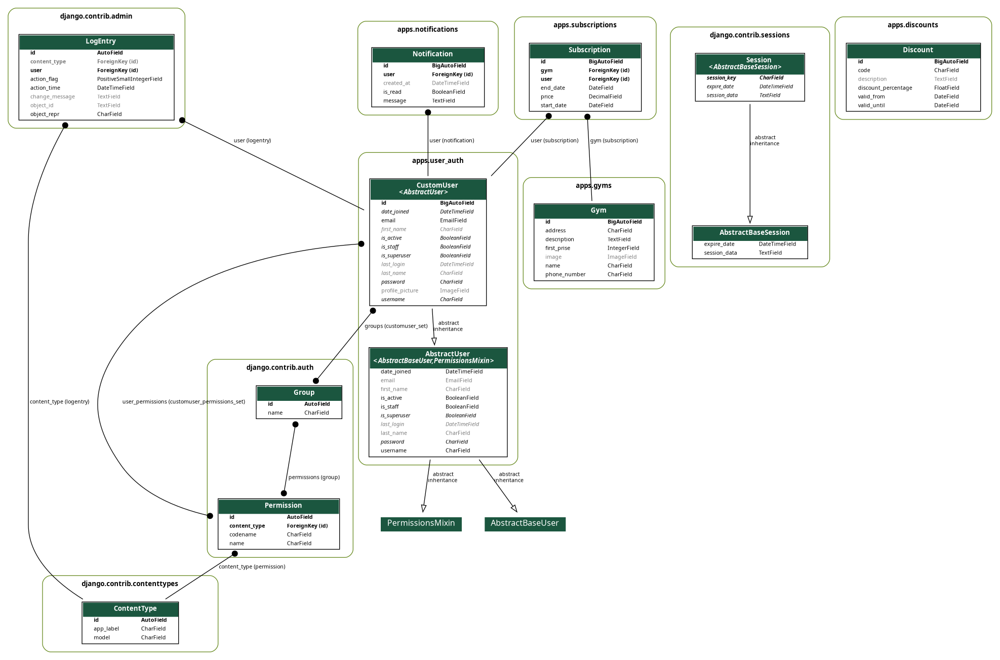

Приложение на джанго для покупки абониментов в спортзал

примерная схема проекта


схема проекта



Инструкции по запуску приложения:

1. **Запуск без Docker**

    Склонируйте проект (или перенесите файлы) на свою локальную машину.

2. **Создайте и активируйте виртуальное окружение (рекомендуется, но не обязательно):**

python3 -m venv venv
source venv/bin/activate

    На Windows: venv\Scripts\activate.

3. **Установите зависимости из requirements.txt, если он у вас есть (или из pyproject.toml/setup.py, в зависимости от того, как проект структурирован):**

pip install -r requirements.txt

Если вы используете requirements.txt, убедитесь, что он включает Django, celery, redis и т.д.

4. **Настройте переменные окружения**

    У вас есть файл .env в корне проекта (ticket_gym/ticket_gym/.env). Убедитесь, что в нём указаны правильные данные БД, Celery-брокера, ключи и т.п.
    Убедитесь, что DEBUG=True при локальной разработке.
    Если .env не существует, создайте его на основе примера и пропишите нужные значения (DB_NAME, DB_USER, DB_PASSWORD, CELERY_BROKER_URL и т.д.).

5. **Настройте базу данных**

    Убедитесь, что PostgreSQL запущен (или любая другая СУБД, которую вы используете).
    При необходимости создайте пустую БД с именем, указанным в .env (например, database_name).

6. **Выполните миграции Django:**

python manage.py makemigrations
python manage.py migrate

Это создаст/обновит таблицы в вашей базе.

7. **Создайте суперпользователя (админа) для входа в панель /admin/ (необязательно, но удобно):**

python manage.py createsuperuser

8. **Запустите дев-сервер Django:**

python manage.py runserver

По умолчанию сайт будет доступен на http://127.0.0.1:8000/.

9. **(Опционально) Запустите Celery worker**

    Если в проекте требуется асинхронная обработка (уведомления, email и т.п.), запустите Celery:

        celery -A ticket_gym worker -l info

        Предварительно убедитесь, что Redis (или другой брокер) запущен и доступен по адресу CELERY_BROKER_URL, указанному в .env.
        Теперь при оформлении абонементов или отправке уведомлений Celery будет обрабатывать фоновые задачи.

10. **Проверьте проект**
        Зайдите в браузер по адресу http://127.0.0.1:8000/ — должна открыться главная страница.
        Зайдите на http://127.0.0.1:8000/admin/ — панель администрирования (используйте логин/пароль, заданные при createsuperuser).

Таким образом, проект будет работать локально без использования Docker.


1. **Установите Docker и Docker Compose:**
   - Если Docker и Docker Compose еще не установлены, загрузите и установите их с [официального сайта Docker](https://www.docker.com/).
   Проверьте командой docker --version и docker-compose --version

2. **Склонируйте репозиторий:**
   ```bash
   git clone https://github.com/Rysetski/Aboniment_v_sportzal_django
   Склонируйте проект на свою машину (или поместите Dockerfile и docker-compose.yml в корень проекта).
   ```

3. **Создайте и активируйте виртуальное окружение (опционально):**
   ```bash
   python -m venv venv
   source venv/bin/activate  # Для Linux/Mac
   venv\Scripts\activate   # Для Windows
   ```

4. **Установите зависимости (если не используете Docker):**
   ```bash
   pip install -r requirements.txt
   ```
   Настройте файл .env или переменные окружения для Docker

    Убедитесь, что .env содержит нужные переменные (D# Основные настройки
SECRET_KEY=
DEBUG=True
ALLOWED_HOSTS=localhost,127.0.0.1

# Настройки базы данных
DB_NAME=database_name
DB_USER=
DB_PASSWORD=
DB_HOST=127.0.0.1
DB_PORT=5432

# Настройки Celery
CELERY_BROKER_URL=redis://localhost:6379/0

EMAIL_HOST=
EMAIL_PORT=587
EMAIL_HOST_USER=
EMAIL_HOST_PASSWORD=
EMAIL_USE_TLS=True).
    Если docker-compose берет из .env, всё должно подтягиваться автоматически.
    Иногда вместо .env используется docker-compose.override.yml и т.п. — зависит от вашей конфигурации.

5. **Запустите приложение с помощью Docker:**
   - Убедитесь, что в корневой директории проекта находится файл `docker-compose.yml`.
   - Запустите контейнеры:
     ```bash
     docker-compose up --build
     Параметр --build соберёт образ с нуля.
     ```
     docker-compose logs -f
     Если вы хотите запустить их в фоновом режиме, используйте -d (detached):
   Убедитесь, что Django стартовал без ошибок, а база данных и Redis (если используете) тоже запустились успешно.

6. **Примените миграции базы данных:**
   - В новом терминале, подключенном к контейнеру `web`, выполните:
     ```bash
     docker exec -it gym_web python manage.py makemigrations
     docker exec -it gym_web python manage.py migrate
     ```

7. **Создайте суперпользователя (для доступа к админке):**
   ```bash
   docker exec -it gym_web python manage.py createsuperuser
   ```
8. **Проверьте, что приложение доступно**

    Обычно оно доступно по http://localhost:8000/ (или тому порту, который вы пробросили в docker-compose.yml).
    Точно так же заходите на /admin/ для админ-панели.

9. **Celery + Redis**

    Если в docker-compose.yml настроены сервисы redis (брокер) и celery (worker) — они поднимутся автоматически.
    Убедитесь, что CELERY_BROKER_URL=redis://redis:6379/0 (или как вы указали в docker-compose).
    Если worker запускается автоматически при старте, вы сразу готовы к выполнению фоновых задач.
    Если нет, возможно, нужно отдельно прописать в docker-compose еще один сервис для worker’а:

        worker:
          build: .
          command: celery -A ticket_gym worker -l info
          depends_on:
            - redis
            - db

        Тогда, поднимая контейнеры, вы получите все компоненты в связке.

После этих шагов у вас должен работать Docker-стек: Django, PostgreSQL (или другая БД), Redis (брокер Celery) и 
Celery worker (если он описан в docker-compose). Вы сможете заходить на localhost:8000 и пользоваться приложением 
так же, как в локальном запуске без Docker.


10. **Откройте приложение в браузере:**
   - Для локального запуска: [http://127.0.0.1:8000](http://127.0.0.1:8000)
   - Для Docker: [http://localhost:8000](http://localhost:8000)

11. **Доступ к API:**
    - API доступен по пути `/api/`.
    - Используйте такие маршруты, как:
      - `/api/gyms/` для работы со спортзалами.
      - `/api/subscriptions/` для подписок.
      - `/api/trainers/` для списка тренеров.
      - `/api/training-sessions/` для списка тренировок.

12. **Доступ к авторизации:**
    - Регистрация: [http://localhost:8000/auth/register/](http://localhost:8000/auth/register/)
    - Вход: [http://localhost:8000/auth/login/](http://localhost:8000/auth/login/)
    - Выход: [http://localhost:8000/auth/logout/](http://localhost:8000/auth/logout/)
